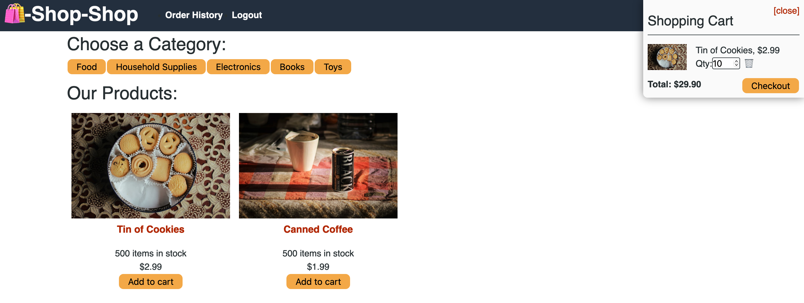

# Shop-Shop

This app was refactored to use Redux instead of the React Context API.

At least within the confines of this app, Redux and Context function very similarly, but use somewhat different syntax to achieve the same results.

Redux was implemented with the `@reduxjs/toolkit` and `react-redux` packages. The former provides streamlined syntax for creating the global store and writing actions and reducers. The latter provides hooks for React, namely `useSelector` to read the state and `useDispatch` to update the state.

GitHub: https://github.com/gavin-asay/shop-shop

Deployed App:

